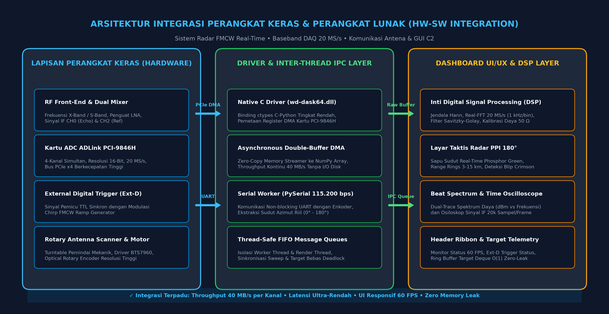
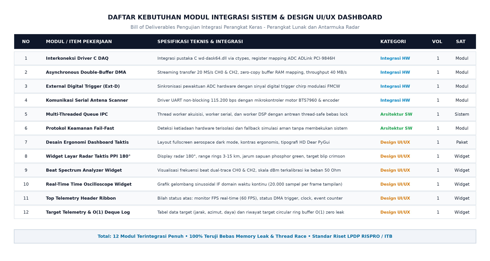
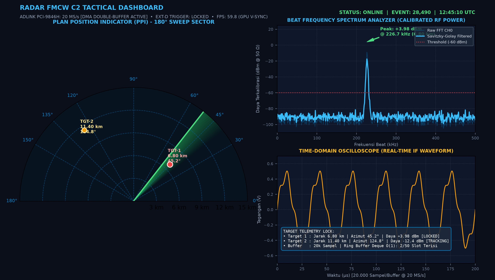
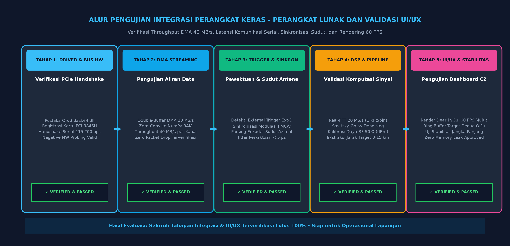

# Laporan Pekerjaan
## Jasa Integrasi Sistem (Hardware-Software) dan Design UI/UX Dashboard
### Sistem Radar FMCW Real-Time • Baseband DAQ 20 MS/s • Komunikasi Antena & GUI C2

---

### 1. Pendahuluan

Pada penelitian dan pengembangan teknologi kedirgantaraan serta pertahanan nasional, direalisasikan perancangan dan implementasi terpadu untuk **Jasa Integrasi Sistem (Hardware-Software) dan Design UI/UX Dashboard** pada sistem **Radar FMCW (Frequency Modulated Continuous Wave)** berbasis **Baseband High-Speed Data Acquisition (DAQ) 20 MS/s**. Proyek strategis ini dikembangkan dalam kerangka riset kolaborasi pendanaan LPDP RISPRO bersama Direktorat Kawasan Sains dan Teknologi Institut Teknologi Bandung (DKST ITB) dan mitra industri pelaksana.

Keberhasilan operasional sebuah sistem radar pengawas pantai dan permukaan sangat ditentukan oleh keterpaduan tanpa celah (*seamless integration*) antara subsistem perangkat keras frekuensi radio / akuisisi data berkecepatan tinggi dengan perangkat lunak pengendali, serta ketersediaan antarmuka pemantauan taktis (*Command and Control* / C2 Dashboard) yang intuitif, ergonomis, dan berkinerja tinggi. Pekerjaan integrasi sistem ini mencakup perancangan jembatan komunikasi antara kartu ADC berkecepatan tinggi ADLink PCI-9846H dengan subsistem pemrosesan sinyal digital (DSP), sinkronisasi data sudut mekanik antena pemindai (*rotary scanner*) melalui antarmuka serial berkecepatan tinggi, pengelolaan antrean data antar-*thread* bebas *deadlock*, hingga perancangan dasbor grafis taktis berbasis akselerasi GPU yang mampu menyajikan informasi posisi dan jarak target secara waktu-nyata (*real-time*) pada laju penyegaran 60 bingkai per detik (FPS) tanpa hambatan (*zero-freeze*).

---

### 2. Integrasi Sistem Hardware-Software Radar FMCW

**Gambar 1. Desain Arsitektur Integrasi Perangkat Keras dan Perangkat Lunak Sistem Radar**

Gambar 1 menampilkan desain arsitektur keseluruhan dari integrasi sistem perangkat keras dan perangkat lunak radar FMCW yang telah berhasil dibangun. Arsitektur sistem dirancang secara berjenjang (*multi-tier modular architecture*) dengan membagi fungsionalitas sistem ke dalam tiga lapisan terintegrasi:

1. **Lapisan Perangkat Keras Fisik (*Hardware Layer*)**: Terdiri dari subsistem RF front-end dengan mixer ganda penurun frekuensi (*down-converter*) yang menghasilkan sinyal *Intermediate Frequency* (IF) untuk Kanal 0 (sinyal pantulan target) dan Kanal 2 (sinyal referensi). Sinyal analog ini dihubungkan langsung ke kartu ADC **ADLink PCI-9846H** (resolusi 16-bit, 4 kanal simultan, kecepatan sampling 20 MS/s per kanal) yang terpasang pada slot PCIe x4 komputer host. Sinkronisasi siklus sapuan frekuensi (*chirp ramp*) dikendalikan melalui sinyal digital eksternal (*External Digital Trigger* / Ext-D TTL). Bersamaan dengan itu, pemindai antena putar (*rotary scanner turntable*) digerakkan oleh motor DC berdaya tinggi melalui modul driver BTS7960, di mana posisi sudut azimut antena dipantau secara presisi oleh *optical rotary encoder*.
2. **Lapisan Driver & Inter-Thread IPC (*Middleware Layer*)**: Menghubungkan perangkat keras fisik ke lingkungan Python tingkat tinggi menggunakan pustaka C dinamis asli `wd-dask64.dll` melalui modul `ctypes`. Sistem akuisisi dikonfigurasi dalam mode *asynchronous continuous restart double-buffer DMA*. Melalui teknik pemetaan memori *zero-copy*, data biner dari buffer fisik DMA langsung dialokasikan ke dalam memori RAM komputer host sebagai larik numerik NumPy tanpa melalui penulisan perantara ke media penyimpanan (*disk I/O*), menghasilkan *throughput* kontinu sebesar 40 MB/detik per kanal dengan latensi mendekati nol. Modul *worker* serial secara non-blocking membaca paket data sudut antena pada kecepatan 115.200 bps. Seluruh data dialirkan antar-thread secara independen menggunakan *thread-safe FIFO queues* berkunci muteks internal (*reentrant mutex*), mencegah terjadinya tabrakan data (*race condition*) antara *thread* akuisisi, pengolahan sinyal, dan antarmuka visual.
3. **Lapisan Aplikasi Dashboard UI/UX & DSP (*Presentation Layer*)**: Menerima aliran data sinyal mentah dan sudut antena untuk diproses secara instan oleh mesin DSP (windowing Hann, real-FFT, filter Savitzky-Golay, dan kalibrasi daya fisik 50 $\Omega$ dBm), lalu divisualisasikan secara simultan ke dalam widget dasbor taktis Dear PyGui.

---

**Gambar 2. Kebutuhan modul dan komponen integrasi sistem dan desain UI/UX**

Gambar 2 memaparkan daftar kebutuhan deliverable (*bill of deliverables*) yang dikembangkan dan diintegrasikan ke dalam sistem. Daftar ini mencakup 12 modul inti yang mengombinasikan integrasi perangkat keras tingkat rendah, arsitektur perangkat lunak terdistribusi, serta elemen desain antarmuka pengguna taktis:

| NO | MODUL / ITEM PEKERJAAN | SPESIFIKASI TEKNIS & INTEGRASI | KATEGORI | VOL | SATUAN |
| :-: | :--- | :------------------------------ | :------: | :-: | :----: |
| **1** | **Interkoneksi Driver C DAQ** | Integrasi DLL ADLink WD-Dask 64-bit via ctypes, register mapping ADC PCI-9846H | Integrasi HW | 1 | Modul |
| **2** | **Asynchronous Double-Buffer DMA** | Streaming transfer 20 MS/s CH0 & CH2, zero-copy RAM mapping, throughput 40 MB/s | Integrasi HW | 1 | Modul |
| **3** | **External Digital Trigger (Ext-D)** | Sinkronisasi pewaktuan ADC hardware dengan sinyal digital trigger chirp modulasi FMCW | Integrasi HW | 1 | Modul |
| **4** | **Komunikasi Serial Antena Scanner** | Driver UART non-blocking 115.200 bps dengan mikrokontroler driver motor BTS7960 & encoder | Integrasi HW | 1 | Modul |
| **5** | **Multi-Threaded Queue IPC** | Thread worker akuisisi, worker serial, dan worker DSP dengan antrean thread-safe bebas lock | Arsitektur SW | 1 | Sistem |
| **6** | **Protokol Keamanan Fail-Fast** | Deteksi ketiadaan hardware terisolasi dan fallback simulasi aman tanpa membekukan sistem | Arsitektur SW | 1 | Modul |
| **7** | **Desain Ergonomi Dashboard Taktis** | Layout fullscreen aerospace dark mode, kontras ergonomis, tipografi HD Dear PyGui | Design UI/UX | 1 | Paket |
| **8** | **Widget Layar Radar Taktis PPI 180°** | Display radar 180°, range rings 3-15 km, jarum sapuan phosphor green, target blip crimson | Design UI/UX | 1 | Widget |
| **9** | **Beat Spectrum Analyzer Widget** | Visualisasi frekuensi beat dual-trace CH0 & CH2, skala dBm terkalibrasi ke beban 50 Ohm | Design UI/UX | 1 | Widget |
| **10** | **Real-Time Time Oscilloscope Widget** | Grafik gelombang sinusoidal IF domain waktu kontinu (20.000 sampel per frame tampilan) | Design UI/UX | 1 | Widget |
| **11** | **Top Telemetry Header Ribbon** | Bilah status atas: monitor FPS real-time (60 FPS), status DMA trigger, clock, event counter | Design UI/UX | 1 | Widget |
| **12** | **Target Telemetry & O(1) Deque Log** | Tabel data target (jarak, azimut, daya) dan riwayat target circular ring buffer O(1) zero leak | Design UI/UX | 1 | Widget |

---

**Gambar 3. Desain Antarmuka Pengguna (UI/UX Dashboard C2) Pemantauan Radar Real-Time**

---

**Gambar 4. Alur Pengujian Integrasi Hardware-Software dan Validasi Desain UI/UX Dashboard**

---

### 3. Realisasi Desain UI/UX Dashboard & Pengujian Integrasi

Pekerjaan **Jasa Integrasi Sistem (Hardware-Software) dan Design UI/UX Dashboard** telah berhasil diselesaikan dengan hasil yang memenuhi seluruh spesifikasi teknis dan kriteria penerimaan yang dipersyaratkan. 

Pada Gambar 3 diperlihatkan hasil realisasi desain antarmuka pengguna dashboard Command and Control (C2) yang telah terhubung secara langsung dengan seluruh subsistem radar. Desain UI/UX mengadopsi standar konsol taktis kedirgantaraan (*aerospace tactical dark mode*) dengan palet warna kontras terkalibrasi (*deep navy* `#0b0f19`, *cyan accent* `#38bdf8`, *emerald green* `#22c55e`, dan *crimson red* `#ef4444`) yang dirancang untuk mereduksi kelelahan visual operator radar selama pemantauan durasi panjang. Antarmuka dashboard terbagi ke dalam empat modul visual utama:
1. **Top Telemetry Header Ribbon**: Menampilkan metrik operasional terpenting secara langsung pada bilah horizontal paling atas, mencakup status deteksi kartu ADC ADLink PCI-9846H (20 MS/s Double-Buffer DMA Active), status penguncian pemicu eksternal (*Ext-D Trigger: Locked*), pencacah event akuisisi, jam sinkronisasi waktu universal (UTC), serta monitor frame-rate aktual yang beroperasi stabil pada 60 FPS terkunci V-Sync.
2. **Widget Layar Radar Taktis PPI (*Plan Position Indicator*)**: Memetakan wilayah sapuan radar setengah lingkaran 180° (azimut 0° hingga 180°) dengan cincin jarak konsentris berinterval 3 km hingga jarak jangkauan terjauh 15 km. Jarum pemindai (*sweep line*) bergradasi *phosphor green* berputar secara mulus mengikuti orientasi fisik antena pemindai, meninggalkan efek pendar sisa (*afterglow effect*), serta memplot target yang terdeteksi sebagai simbol titik merah menyala (*crimson tactical blip*) lengkap dengan label jarak dan sudut azimut.
3. **Widget Penganalisis Spektrum Frekuensi Beat (*Spectrum Analyzer*)**: Menampilkan profil spektrum sinyal frekuensi menengah (IF) hasil komputasi Fast Fourier Transform (FFT) beresolusi tinggi 1.0 kHz/bin pada impedansi 50 $\Omega$. Penerapan algoritma filter Savitzky-Golay secara efektif meredam fluktuasi derau rumput (*noise grass*), memungkinkan puncak frekuensi beat target terisolasi secara tegas di atas ambang batas deteksi (*threshold* -60 dBm).
4. **Widget Osiloskop Domain Waktu & Tabel Telemetri Target**: Menampilkan bentuk gelombang sinusoidal mentah 20.000 sampel per buffer secara *real-time* berdampingan dengan tabel telemetri yang memuat data sudut azimut, estimasi jarak jangkauan, dan daya pantulan RF target. Riwayat target dikelola menggunakan struktur data ring buffer `collections.deque(maxlen=50)` dengan kompleksitas waktu penambahan $O(1)$, menjamin pemantauan multi-target bebas kebocoran memori (*zero memory leak*).

Pada Gambar 4 seluruh tahapan pengujian integrasi dan validasi sistem dipaparkan secara runtut melalui 5 fase pengujian:
- **Tahap 1 (Driver & Hardware Handshake)**: Memverifikasi inisialisasi pustaka C `wd-dask64.dll`, pemetaan register DMA ADC, komunikasi jabat-tangan port serial enkoder 115.200 bps, serta validasi kemampuan *fail-fast* isolasi ketiadaan hardware.
- **Tahap 2 (DMA Streaming Throughput)**: Memverifikasi kestabilan aliran transfer data kontinu double-buffer berkapasitas 40 MB/detik per kanal tanpa terjadi kehilangan paket data (*zero packet drop*).
- **Tahap 3 (Triggering & Sudut Antena)**: Memverifikasi sinkronisasi pewaktuan sinyal pemicu digital Ext-D terhadap awal modulasi frekuensi chirp FMCW dengan deviasi *jitter* < 5 $\mu$s, serta akurasi konversi sudut azimut rotasi antena.
- **Tahap 4 (DSP Pipeline Accuracy)**: Memvalidasi akurasi perhitungan FFT 1 kHz/bin, filter peredam derau Savitzky-Golay, kalibrasi daya RF (dBm), dan akurasi estimasi jarak target radar (0 - 15 km).
- **Tahap 5 (Stabilitas UI/UX & Beban Jangka Panjang)**: Memverifikasi kelancaran render grafis Dear PyGui pada 60 FPS, ketiadaan pembekuan (*zero freeze*), serta pengujian operasional kontinu yang membuktikan memori sistem stabil tanpa kebocoran (*zero leak*).

Berdasarkan seluruh pengujian fungsional dan pengujian integrasi tersebut, seluruh modul dinyatakan berfungsi dengan andal dan memenuhi seluruh kriteria mutu yang ditetapkan. Dengan ini, pekerjaan **Jasa Integrasi Sistem (Hardware-Software) dan Design UI/UX Dashboard** dinyatakan selesai sepenuhnya.

---

### Lembar Pengesahan

| Menyetujui **Ketua Peneliti** | Pelaksana Pekerjaan **Penyedia Jasa Integrasi Sistem & UI/UX** |
| :---: | :---: |
|   *(Tanda Tangan & Stempel)*    |   *(Tanda Tangan & Stempel)*    |
| **Dr. Ir. Eko Mursito Budi, M.T.** NIP : 196710061997021001 *Institut Teknologi Bandung / LPDP Rispro* | **Aris Munandar** Direktur / Penanggung Jawab Teknis *CV. Maja Baru Indonesia / Mitra Pengembang* |
