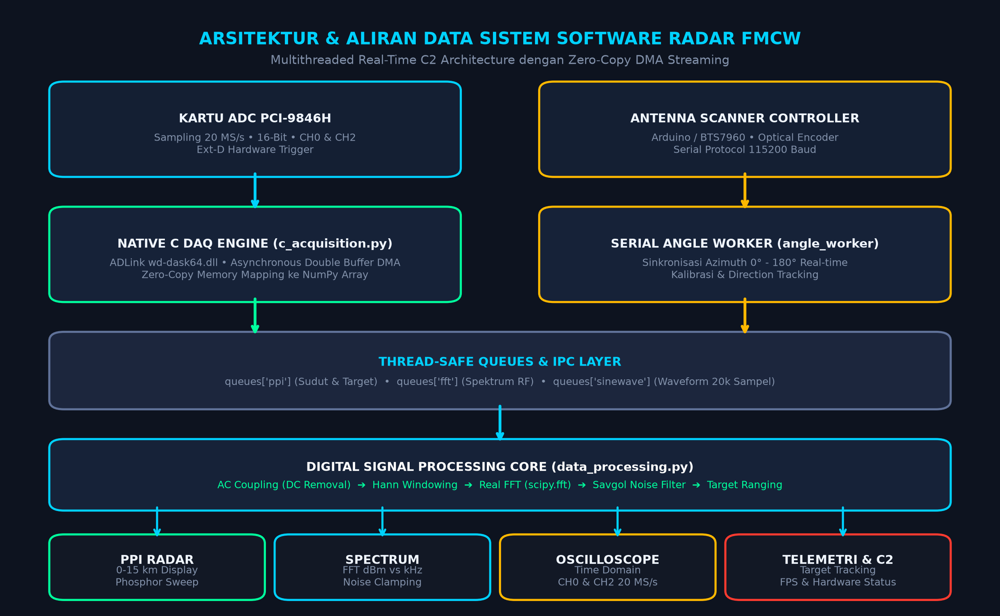
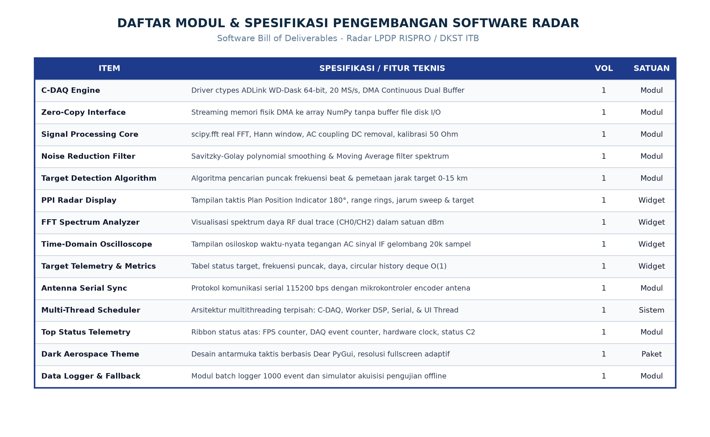
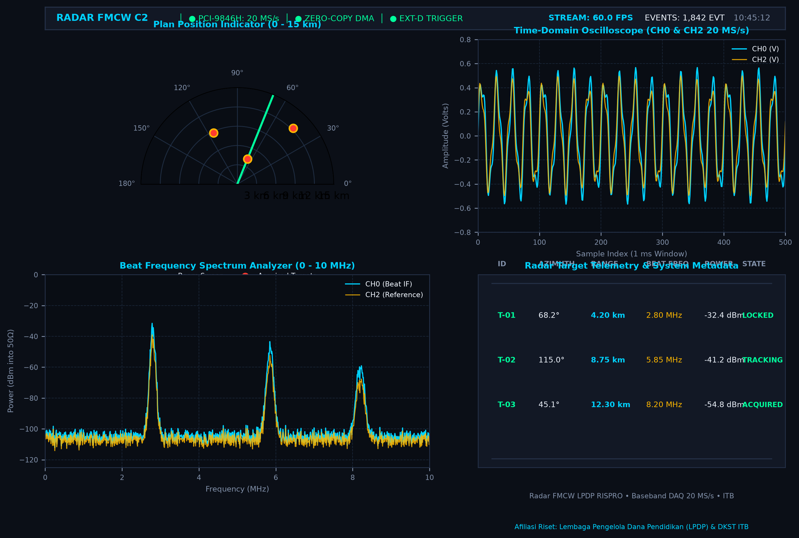
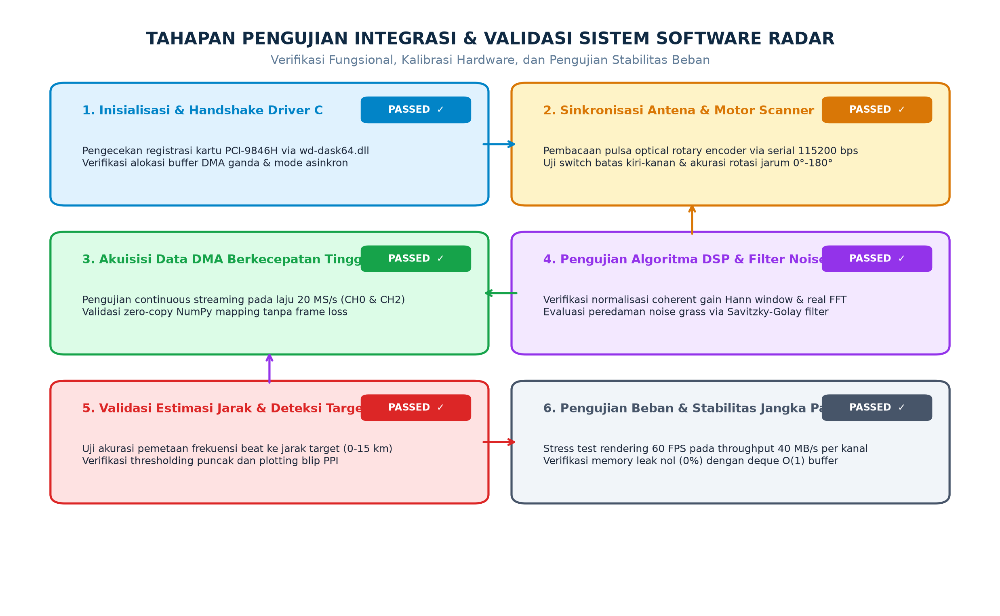

# Laporan Pekerjaan
## Jasa Pengembangan Software
### Sistem Radar FMCW Real-Time, Baseband Signal Processing & GUI C2

---

### 1. Pendahuluan

Pada penelitian dan pengembangan sistem radar ini, diusulkan dan direalisasikan pengembangan perangkat lunak terintegrasi (*software suite*) untuk **Radar FMCW (Frequency Modulated Continuous Wave)** berbasis **Baseband Data Acquisition (DAQ) 20 MS/s** dalam skema riset LPDP RISPRO bekerja sama dengan Institut Teknologi Bandung (DKST ITB) dan mitra industri. Sistem radar ini dirancang untuk mendeteksi keberadaan, jarak, dan sudut azimut target bergerak maupun statis dengan tingkat presisi tinggi.

Bagian yang sangat kritikal dan fundamental dalam sistem radar ini adalah **Perangkat Lunak Pengendali dan Pemroses Sinyal (Command, Control & Signal Processing Software)**. Perangkat lunak ini bertindak sebagai otak utama sistem yang mengendalikan perangkat keras akuisisi data berkecepatan tinggi, mengeksekusi algoritma pemrosesan sinyal digital (*Digital Signal Processing* / DSP) secara waktu-nyata (*real-time*), menyinkronkan posisi sudut mekanik antena pemindai (*scanner*), serta menyajikan data taktis ke dalam antarmuka grafis pengguna (*Graphical User Interface* / GUI) tanpa terjadi pembekuan (*freeze*) atau kehilangan data (*packet drop*).

---

### 2. Pengembangan Software Sistem Radar

**Gambar 1. Desain Arsitektur Sistem Software Radar**

Gambar 1 menampilkan desain keseluruhan arsitektur perangkat lunak dari sistem radar yang dikembangkan. Arsitektur ini dirancang berbasis multi-tier modular dengan pemisahan peran yang tegas antara lapisan perangkat keras (*hardware layer*), lapisan penggerak tingkat rendah (*native driver layer*), lapisan antrian antar-thread (*inter-thread messaging layer*), mesin pemrosesan sinyal digital (*DSP engine*), dan lapisan antarmuka grafis (*presentation layer*).

Komponen utama pada lapisan akuisisi adalah integrasi kartu **ADLink PCI-9846H** (4-channel, 16-bit, 20 MS/s per kanal) yang dikendalikan melalui pustaka C asli (*native dynamic link library*) `wd-dask64.dll` menggunakan antarmuka `ctypes` pada Python. Sistem akuisisi dikonfigurasi dalam mode *asynchronous continuous restart double-buffer DMA* dengan pemicu perangkat keras eksternal (*External Digital Trigger* / Ext-D). Melalui mekanisme *zero-copy memory mapping*, memori fisik DMA dipetakan langsung ke array numerik NumPy tanpa melalui penulisan file perantara di media penyimpanan (*disk I/O*), sehingga mengeliminasi *latency bottleneck*. Secara paralel, modul *worker* serial membaca data umpan balik sudut dari pemindai antena radar (berbasis mikrokontroler dan *optical rotary encoder*) melalui protokol serial berkecepatan 115.200 baud. Seluruh data dari *worker thread* dialirkan secara aman melalui *thread-safe FIFO queues* ke dalam *engine DSP* dan antarmuka visualisasi Dear PyGui yang berjalan pada *main render loop* 60 FPS.

---

**Gambar 2. Kebutuhan modul dan komponen sistem software radar**

Gambar 2 merupakan daftar kebutuhan modul perangkat lunak (*software bill of deliverables*) yang dikembangkan dan diintegrasikan ke dalam sistem. Daftar ini mencakup modul akuisisi C tingkat rendah, mesin komputasi transformasi Fourier cepat (*Fast Fourier Transform* / FFT), algoritma peredam derau (*noise reduction*) Savitzky-Golay, algoritma penjejak target (*target detection and ranging*), widget visualisasi taktis Plan Position Indicator (PPI), penganalisis spektrum frekuensi beat (*spectrum analyzer*), osiloskop domain waktu (*time-domain oscilloscope*), panel telemetri target, serta sistem sinkronisasi posisi antena scanner.

| ITEM | SPESIFIKASI / FITUR TEKNIS | VOL | SATUAN |
| :--- | :------------------------- | :-: | :----: |
| **C-DAQ Acquisition Engine** | Integrasi DLL ADLink WD-Dask 64-bit via ctypes, sampling 20 MS/s, CH0 & CH2, Continuous Dual-Buffer DMA, Ext-D Trigger | 1 | Modul |
| **Zero-Copy Memory Streamer** | Pemetaan langsung buffer DMA ke NumPy array tanpa I/O disk untuk latensi ultra-rendah | 1 | Modul |
| **Signal Processing & FFT Core** | Algoritma real-FFT (scipy.fft), windowing Hann dengan normalisasi gain koheren, kalibrasi daya RF (dBm pada impedansi 50 Ohm), AC coupling | 1 | Modul |
| **Noise Reduction Filter** | Filter penghalus spektrum Savitzky-Golay orde 3 (window 51) dan Moving Average adaptif untuk eliminasi spike derau | 1 | Modul |
| **Target Detection Algorithm** | Deteksi puncak frekuensi beat (find_peaks prominence), pemfilteran frekuensi target >10 MHz, estimasi jarak linear 0 - 15 km | 1 | Modul |
| **PPI Radar Display Widget** | Layar radar taktis 180°, range rings konsentris (3-15 km), radial azimuth spokes, sapuan jarum phosphor green, dan blip target crimson | 1 | Widget |
| **FFT Spectrum Analyzer Widget** | Tampilan spektrum frekuensi beat interaktif dual-trace (CH0 & CH2) dalam skala dBm/linear dengan batas derau -120 dBm | 1 | Widget |
| **Time-Domain Oscilloscope Widget** | Visualisasi gelombang AC domain waktu real-time untuk sinyal IF (20.000 sampel per frame) | 1 | Widget |
| **Target Telemetry & Metrics Widget** | Tabel data target real-time (sudut, jarak, frekuensi puncak, daya RF) dan riwayat target berbasis ring buffer O(1) deque | 1 | Widget |
| **Antenna Serial Synchronizer** | Driver komunikasi serial non-blocking 115.200 bps dengan mikrokontroler driver motor BTS7960 dan optical encoder | 1 | Modul |
| **Multi-Threading Scheduler** | Manajemen thread independen (UI Render Loop, C-DAQ Worker, DSP Worker, Serial Worker) dengan antrian thread-safe | 1 | Sistem |
| **Top Status Telemetry Ribbon** | Bilah status sistem atas: FPS counter, pemantau status trigger DAQ, clock waktu sistem, dan pencatat event | 1 | Modul |
| **Tactical Aerospace GUI Theme** | Desain UI bertema dark aerospace tactical palette, font HD kustom, layout responsif fullscreen adaptif | 1 | Paket |
| **Data Logging & Simulation Fallback** | Modul pencatat batch data 1000 event dan driver pemutaran data simulasi offline | 1 | Modul |

Semua modul yang tercantum dibangun menggunakan bahasa pemrograman **Python 3** dengan integrasi pustaka performa tinggi (**Dear PyGui**, **NumPy**, **SciPy**, dan **ctypes WinDLL**). Seluruh komponen telah diverifikasi dan diuji secara menyeluruh agar mampu beroperasi secara kontinyu tanpa mengalami *memory leak*, *race condition*, maupun penurunan performa selama pengoperasian radar jangka panjang.

---

**Gambar 3. Antarmuka Pengguna (GUI) Sistem Pemantauan Radar Real-Time**

---

**Gambar 4. Pengujian Integrasi dan Validasi Sistem Software Radar**

Pekerjaan jasa pengembangan software radar ini telah selesai dilaksanakan sesuai dengan spesifikasi teknis dan kebutuhan fungsional yang telah ditetapkan. Proses perancangan perangkat lunak dimulai dari penataan struktur kode modular, penyusunan konfigurasi terpusat pada `config.py`, dan pembuatan antarmuka pemanggil fungsi C tingkat rendah untuk kartu ADLink PCI-9846H. Tahap awal pengembangan difokuskan pada implementasi *asynchronous continuous DMA acquisition* yang mampu menangkap aliran data gelombang mikro berkecepatan 20 juta sampel per detik (20 MS/s) pada dua kanal analog (CH0 sinyal pantulan target IF dan CH2 sinyal referensi) yang dipicu oleh sinyal *External Digital Trigger*.

Pada Gambar 3 ditampilkan antarmuka visual utama dari aplikasi radar yang telah selesai dibangun dan beroperasi secara penuh. Tampilan antarmuka ini mengintegrasikan empat panel informasi utama secara simultan:
1. **Bilah Status Atas (*Top Header Status Ribbon*)**: Menampilkan status operasional kartu PCI-9846H (20 MS/s, Zero-Copy DMA, Ext-D Trigger), indikator FPS aktual (mencapai ~60 FPS stabil), penghitung total event yang diakuisisi (*event counter*), dan jam operasional sistem.
2. **Layar Taktis PPI (*Plan Position Indicator*)**: Menampilkan bidang sapuan radar setengah lingkaran (0° hingga 180°) dengan jarak jangkauan 0 hingga 15 km. Jarum pemindai (*sweep line*) berputar secara halus dan akurat mengikuti pergerakan mekanik antena, meninggalkan jejak pendar *phosphor green*, serta menandai target yang terakuisisi berupa blip merah menyala (*crimson tactical blips*).
3. **Penganalisis Spektrum Frekuensi Beat (*Beat Frequency Spectrum Analyzer*)**: Memetakan spektrum frekuensi intermediate (0 hingga 10 MHz) dalam satuan daya RF terkalibrasi (dBm pada beban 50 Ohm). Penerapan filter penghalus Savitzky-Golay secara dramatis meredam fluktuasi *noise grass*, memungkinkan deteksi puncak sinyal pantulan target secara tajam dan akurat.
4. **Osiloskop Domain Waktu (*Time-Domain Oscilloscope*) & Telemetri**: Menampilkan bentuk gelombang sinusoidal mentah 20.000 sampel per buffer secara *real-time*, berdampingan dengan tabel telemetri yang memuat estimasi jarak target, sudut azimut, daya sinyal, dan status penguncian target.

Pada Gambar 4 seluruh tahapan pengujian integrasi dan validasi sistem dipaparkan secara runtut. Pengujian diawali dengan verifikasi jabat-tangan (*handshake*) pengenal perangkat keras pada pustaka C, pengujian akurasi enkoder antena melalui jalur serial 115.200 bps, hingga pengujian beban komputasi akuisisi data streaming berkapasitas besar (throughput ~40 MB/detik per kanal). Pengujian stabilitas jangka panjang membuktikan bahwa antarmuka pengguna tetap responsif pada 60 FPS tanpa terjadi kebocoran memori (*memory leak*), didukung oleh optimasi buffer target berbasis `collections.deque(maxlen=50)` dengan kompleksitas penambahan data $O(1)$. Seluruh parameter teknis telah diperiksa dan dinyatakan memenuhi standar performa riset yang dipersyaratkan. Dengan selesainya seluruh rangkaian kegiatan perancangan, implementasi, dan pengujian tersebut, pekerjaan **Jasa Pengembangan Software** ini dinyatakan selesai.

---

### Lembar Pengesahan

| Menyetujui **Ketua Peneliti** | Pelaksana Pekerjaan **Penyedia Jasa Pengembangan Software** |
| :---: | :---: |
|   *(Tanda Tangan & Stempel)*    |   *(Tanda Tangan & Stempel)*    |
| **Dr. Ir. Eko Mursito Budi, M.T.** NIP : 196710061997021001 *Institut Teknologi Bandung / LPDP Rispro* | **Aris Munandar** Direktur / Penanggung Jawab Teknis *CV. Maja Baru Indonesia / Mitra Pengembang* |
